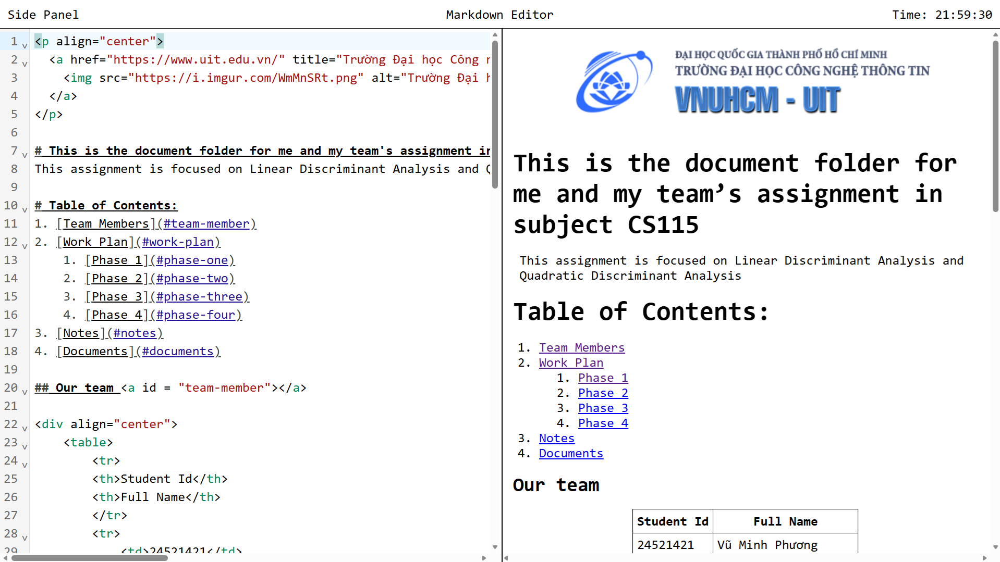
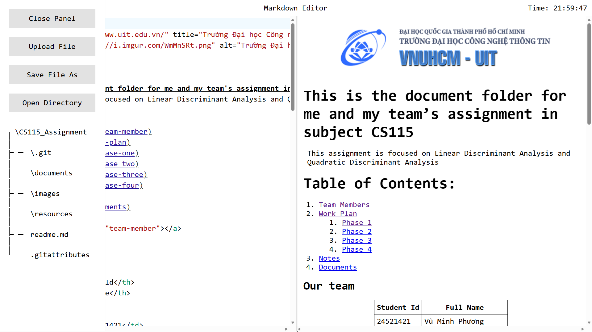

# Markdown Editor

## Framework + Libraries:
These are frameworks and libraries that I used:
- [ReactJS](https://react.dev/)
- [Code Mirror](https://codemirror.net/)
- [MarkdownIt](https://www.npmjs.com/package/markdown-it)
- [HighlightJS](https://highlightjs.readthedocs.io/en/latest/#)

## Overview:

Through out markdown editors that I have used, I couldn't help myself thinking to build my own markdown editor. All I wanted is a lightweight editor that supports mathtex, across devices synchronous. So I started building this project.

## Features:

### Lightweight live-editting 

Somewhat this is the main interface of the app, I might improve the UI oneday. For now, it is simple but still effective. 

But one thing that is so frustrating is that with a large markdown content (without math rendering) it can only run smoothly until 50k lines on my computer and somewhere 1k lines with near complex math.

I'm working on improving the performance of the markdown parser by techniques like batch processing, lazy loading, ... Yet I'm still trying to figure it out.

## Interactable File Navigator

This is a idea that came across my mind and I found it very interesting. I want to create a in-app file navigator that can interact, drag&drop which can directly change the file structure.

I'm working on this part in the file-navigator repo.

### Database synchronization (Upcoming feature)
Basic idea: update file changes to datebase maybe mongoDB or postgreSQL (these two are most familiar DB to me.) 